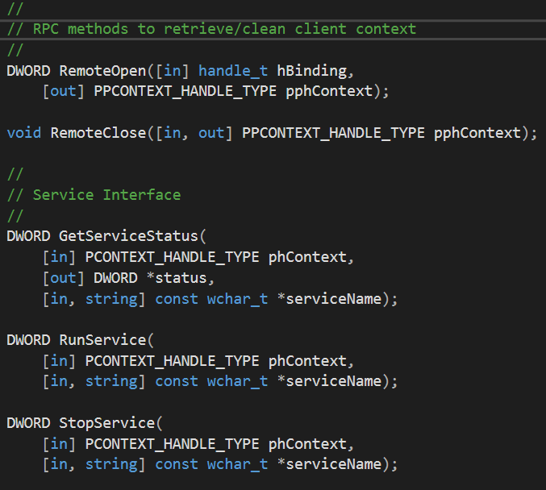

## NTServiceRpc 을 이용하여 UWP 와 네이티브 코드 통신 이해하기 

본 설명은 아래 사이트의 내용을 한글로 재구성함 
https://github.com/Microsoft/Windows-iotcore-samples/tree/master/Samples/NTServiceRpc

# NT 서비스와 UWP 앱의 통신을 RPC 로 진행 
NT 서비스는 보안의 이슈로 RPC 서버의 ACL ( Access Control Lists ) 를 통해 앱과 연동됨 
ACL 은 앱의 시스템 리소스 접근, 사용자 정의 기능 등의 기능과 특별한 PFN ( Package Family Name ) 등의 값을 포함할 수 있음 ( 이 앱에서는 서비스에 연결될 PFN 만 포함함 ) 

RpcInterface : RPC (함수, 매개변수)를 정의하는  IDL ( Interface Definition Language ) 파일 
Rpcserver : RPC 서버, NT서비스로 구동, RPC 의 호출을 받고 상태를 리턴함, 다른 NT 서비스 구동 및 스톱 
NTServiceRpc : UWP 앱, 

# ACL를 사용하여 NT 서비스 접근하기 
RPC 서버에서 특정 어플리케이션의 접근을 하기 위해 ACL 을 사용할 수 있다. 
사용자 정의 접근이나 HW 접근등 보다 많은 정보는 아래 두개의 링크에서 확인할 수 있다. 
	https://github.com/Microsoft/Windows-universal-samples/tree/master/Samples/CustomCapability
	https://docs.microsoft.com/en-us/windows-hardware/drivers/devapps/creating-a-custom-capability-to-pair-driver-with-hsa 
이 샘플에서는 특정 PFN 만 서비스에 접근하는 것을 보여주는 것이다. 
Rpcserver.cpp 에 BuildAcl 함수는 ACL 를 만드는 부분이다. 
	- 모든 사용자가 앱컨테이너를 실행하여 보안 식별자를 갖는다. 샌드박스외의 앱이 서비스에 접근할 권한을 갖을 수 있다. 
	- 해당 앱에 해당하는 보안 식별자를 갖는다. 
	- 두개의 엔트리를 통해 ACL 이 빌드된다. 

기본적으로 PACL 이 리턴되는데 PACL 은 EXPLICIT_ACCESS 두개의 배열을 같는다 ( ea[2] )  ea[0] 은 모든 사용자에 대한 권한이고 ea[1]은 특정 앱패키지에 대한 권한이다. 

# RPC server 실행 
RPC 서버는 앱컨테이너 밖에서 실행되고 Windows API 전부 접근 가능하다. 

# Windows API calls 
ServiceControl.cpp 파일에서 Windows API 를 이용하여 서비스가 제어된다. 
ServiceControl 클래스는 GetServiceStatus, Runservice, StopService 를 통해 함수를 노출시킨다. 

# RPC call 핸들링하기 
RpcServer.cpp 의 메소드는 ServiceControl.cpp 의 함수들을 호출한다. RemoteOpen 메소드는 클라이언트에서 연결을 시작하기위해 호출된다. 그리고 서비스가 context 를 저장할 수 있는 포인터와 포인터사이를 연결한다. 서비스는 ServiceControl 의 인스턴스를 할당하고 포인터로 저장한다. RemoteClose 메소드는 포인터를 지운다. 

다른 모든 호출이 context 로 캐스트되고 ServiceControl 에 정의된 알맞은 메소드를 호출한다. 예외가 발생하면 에러코드로 RPC 크랄이언트에 코드를 리턴한다. 

# Client 을 RPC 에 연결하기 
클라이언트는 UWP 이다. UWP 의 RpcClient.cpp 의 Initialize 함수는 서비스로 부터 포인터와 포인터(서비스 사용을 위한 컨택스트)를 연결해주는 함수이다. 
서비스는 컨텍스트가 무엇이든 할당하고 포인터에 쓰기를 한다. 다른 함수들은 컨텍스트와 변수들을 이용하여 RPC 를 호출하는 함수이다. 

하지만 RPC 는 UI 쓰레드에서 호출될 수 없다. 이를 실행하기 위해 랩퍼를 사용하는데 RpcAsyncWrapper.cpp 의 예를 ㅂㄹ 수 있다. 리턴값은 Concurrency::task 인스턴스 이다. 

어플리케이션에선 async 를 사용하여 콜백을 사용할 수 있다. MainPage.xaml.cpp 에서 Start 버튼은 래퍼를 호출 하고 UI 에 결과를 보여준다. 

# IoT 플랫폼에 서비스와 앱실행 하기 
Rpcserver.exe 실행
Ex : RpcServer.exe -console 
UWP 실행 

NTWerviceRpc : UWP 앱, 
RpcClient 가 RPC 연결 및 함수 호출 

소스 예 

RpcAsyncWrapper : UWP UI 에서 호출하기 위한 Wrapper, RpcClinet 포인터 소유  

각각 함수들은 실제 RpcClient 의 부합하는 함수 호출 
소스 예 

MainPage 

소스 예 

호출 순서 
rpc.RunService -> Wrapper 의 RunService -> Rpc 의 RunService 

RpcInterface : 서비스를 연결할 인터페이스 IDL 정의 

RpcServer : 실제 NT API 가 실행되는 콘솔 앱 
RpcServer 에서 ACL 을 연결하고, ServiceControl 클래스의 API 를 호출한다. 
ServiceControl 의 API 가 이 모든 절차의 끝점이다. 

IDL 에 접근하기 위한 MIDL 은 RpcClient 와 RpcServer 두개 존재함 

